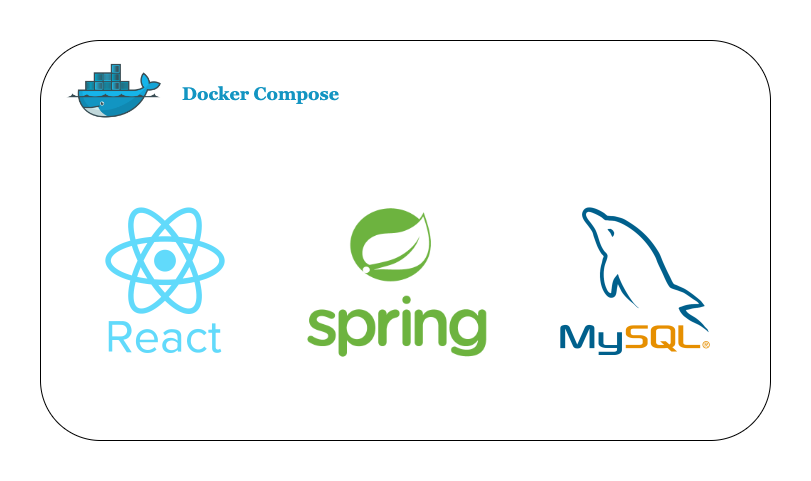

### Car Management System Using React JS , Spring Boot ,MySQL ,and Docker

CarsMS is a comprehensive car management system developed using React JS, Spring Boot, MySQL, and Docker.


## Features

- Car inventory management
- The power of Java Spring Boot As backend and React Lightweighted Framework as FrontEnd
- Nice UI

## Installation

### Prerequisites

- Node.js - React
- Java - SpringBoot
- MySQL
- Docker
- Docker Compose

### Setup Instructions :  Running with Docker Compose

1. Clone the repository
2. Ensure Docker is installed and running on your system.
3. In the project root directory, use the following command:
```
docker-compose up
```
3. This command will start the services defined in the `docker-compose.yml` file.

## Screenshots

### Cars List

CarsMS By M.Touil

### Cars View

CarsMS By M.Touil

### Cars Edit

CarsMS By M.Touil

## Usage

Describe here how to use the application.

## Contributors

- [Mehdi Touil](https://www.linkedin.com/in/mehditouil)
